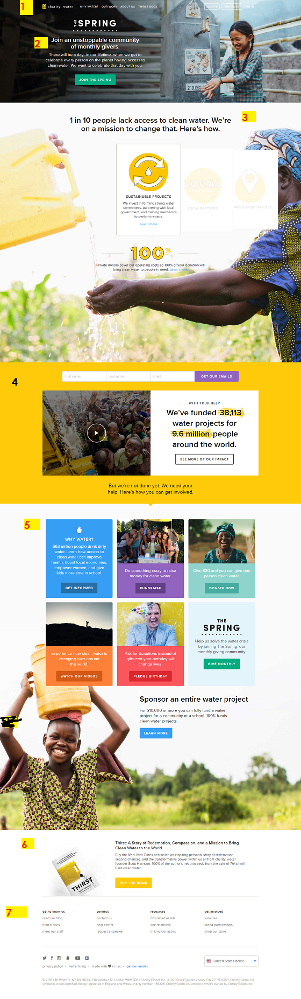
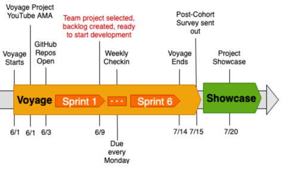

# v9-toucans-team-09

This is a clone of charitywater.org home page using CSS-Grid and Flexbox for the layout, jQuery and JavaScript for the carousel animation.

The site is available [here](https://chingu-voyages.github.io/v9-toucans-team-09/)

# Goal

Use HTML, CSS, and JavaScript to create a web page clone of the [Charitywater.org](https://charitywater.org).

Our product Vision summary is available in this [GoogleDoc]().

## Project Milestones

## Sections

1. Top Nav: Responsive, CTA buttons.
2. Hero Section:Image, compelling featured content .
3. Impact highlight Section:Rotating JavaScript-enabled content .
4. Email form with video embed:A video embed and text with impact stats
5. Call-to-Action Section:6 media cards with image, content and CTA button
6. Promo section: Promo section with CTA button
7. Footer: Footer with page links, social media links, currency drop-down

## Technology Used

- HTML/CSS-Grid & FlexBox layout
- Using JavaScript to manipulate the DOM and event system

## Demo Page

You can review the site [coming soon](https://docs.google.com/presentation/d/11zPc-5KK27--NxX4eDpvt7wqGYR3uLpaZQ5rBZGI4Cw/edit);

## Learning Guides

- CSS Tricks article: [A Complete Guide to Grid](https://css-tricks.com/snippets/css/complete-guide-grid/)

* WS3Schools. [CSS Grid layout module](https://www.w3schools.com/css/css_grid.asp)

* Carousel with swiper [https://idangero.us/swiper/](https://idangero.us/swiper/)

* Flex Navbar [How to build a Navigation Bar with CSS Flexbox](https://freshman.tech/flexbox-navbar/)

* [helpful](https://blog.christopherianmurphy.com/2016/01/responsive-pure-css-menu/)

* Excellent article [see this](https://internetingishard.com/html-and-css/flexbox/)

## Link to demo page

[homepage](https://chingu-voyages.github.io/v9-toucans-team-09/)

## Contributors

- [@LishiTrinity](https://github.com/lishitrinity)
- [@pmutunga](https://github.com/pmutunga)
